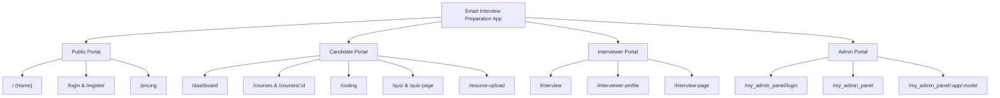

# 🗺️ Smart Interview Preparation - Project Sitemap

Comprehensive mapping of all routes, access controls, components, and backend API endpoints for the Smart Interview Preparation platform.

---

## 🌐 1. Frontend Route Map

### 🔓 Public Routes (Unauthenticated)
| Route Path | Page Component | Description |
| :--- | :--- | :--- |
| `/` | `Home.jsx` | Platform Landing Page with feature overview & CTA |
| `/login` | `Login.jsx` | User authentication & login form |
| `/register` | `Register.jsx` | New user registration form |
| `/otp` | `Otp.jsx` | One-Time Password verification step |
| `/role-selection` | `RoleSelection.jsx` | User onboarding role picker (Candidate vs Interviewer) |
| `/Auth-page` | `AuthPage.jsx` | Authentication fallback / unified auth view |
| `/pricing` | `Pricing.jsx` | Subscription tiers & feature breakdown |
| `/forgot-password` | `ForgotPassword.jsx` | Account recovery & password reset request |
| `/forget-password` | `ForgotPassword.jsx` | Password reset alias route |
| `/reset-password` | `ResetPassword.jsx` | Set new password with reset token |

---

### 👨‍🎓 Candidate Portal (Role: `candidate`)
*Includes routes rendered inside `AppShell` (with Navbar) and standalone full-viewport pages.*

| Route Path | Layout Shell | Page Component | Description |
| :--- | :--- | :--- | :--- |
| `/dashboard` | `AppShell` | `Dashboard.jsx` | Candidate dashboard, analytics, recent activities & quick start |
| `/resume-upload` | `AppShell` | `ResumeUpload.jsx` | Resume parser, AI analysis & skill matching |
| `/courses` | `AppShell` | `Courses.jsx` | Interactive course catalog & learning paths |
| `/courses/:courseId` | `AppShell` | `CourseDetail.jsx` | Specific course curriculum, modules & topics |
| `/courses/:courseId/pdf-viewer` | Standalone | `PdfViewerPage.jsx` | High-performance PDF course material reader |
| `/quiz` | `AppShell` | `Quiz.jsx` | Assessment & quiz category picker |
| `/quiz-page` | Standalone | `QuizPage.jsx` | Timed interactive quiz testing engine |
| `/quiz-result` | Standalone | `QuizResult.jsx` | Quiz performance summary, breakdown & recommendations |
| `/coding` | Standalone | `Coding.jsx` | Code editor sandbox & Piston execution engine |
| `/candidate-profile` | Standalone | `CandidateProfile.jsx` | Candidate profile details & resume metadata setup |

---

### 👨‍🏫 Interviewer Portal (Role: `interviewer`)
| Route Path | Layout Shell | Page Component | Description |
| :--- | :--- | :--- | :--- |
| `/interviewer-profile` | Standalone | `InterviewerProfile.jsx` | Interviewer bio, availability setup & domain expertise |
| `/interview` | `AppShell` | `Interview.jsx` | Live interview dashboard & scheduling hub |
| `/interview-page` | Standalone | `InterviewPage.jsx` | Real-time video/AI interview execution environment |

---

### 👤 Shared Authenticated Routes (Role: `candidate` | `interviewer`)
| Route Path | Layout Shell | Page Component | Description |
| :--- | :--- | :--- | :--- |
| `/profile` | `AppShell` | `Profile.jsx` | User account settings, profile update & security |
| `/feedback-form` | `AppShell` | `FeedbackForm.jsx` | Platform experience & interview session feedback |

---

### ⚙️ Admin Panel (Superuser / Admin Guard)
| Route Path | Component | Description |
| :--- | :--- | :--- |
| `/my_admin_panel/login` | `AdminLogin.jsx` | Dedicated administrator login portal |
| `/my_admin_panel` | `AdminPanel.jsx` | Dynamic Django Admin Wrapper Dashboard |
| `/my_admin_panel/:appLabel/:modelName/*` | `DynamicModelPage.jsx` | Dynamic CRUD management for all Django models |

---

## ⚡ 2. Backend API Endpoint Map (Django REST Framework)

| Module | Base Path | Key Endpoints / Responsibility |
| :--- | :--- | :--- |
| **Authentication** | `/api/auth/` | Login, Register, Refresh Token, OTP Verification, Password Reset |
| **Candidate** | `/api/candidate/` | Profile management, candidate experience records |
| **Interviewer** | `/api/interviewer/` | Interviewer profiles, time slots & availability management |
| **Interview** | `/api/interview/` | Interview scheduling, session tokens & feedback logs |
| **Courses** | `/api/courses/`, `/api/modules/` | Domain list, course modules, topics & PDF materials |
| **Coding & Compiler** | `/api/coding/`, `/api/compiler/` | Coding problem catalog, Piston code execution, testcases |
| **Quiz** | `/api/quiz/` | Question bank, quiz attempt evaluation & score history |
| **Resume AI** | `/api/resume/` | Resume file upload, PDF extraction, skill extraction & scoring |
| **Dashboard** | `/api/dashboard/` | Candidate metrics, progress tracking & activity feeds |
| **Feedback** | `/api/feedback/` | User ratings, bug reports & interview reviews |
| **Notifications** | `/api/notifications/` | Real-time user notifications & system announcements |
| **Analytics** | `/api/analytics/` | Admin metrics, aggregate user statistics |
| **Admin Dynamic** | `/api/admin/`, `/api/admin_panel/` | Schema introspector & dynamic generic model manager |

---

## 📊 3. Visual Architecture Hierarchy

